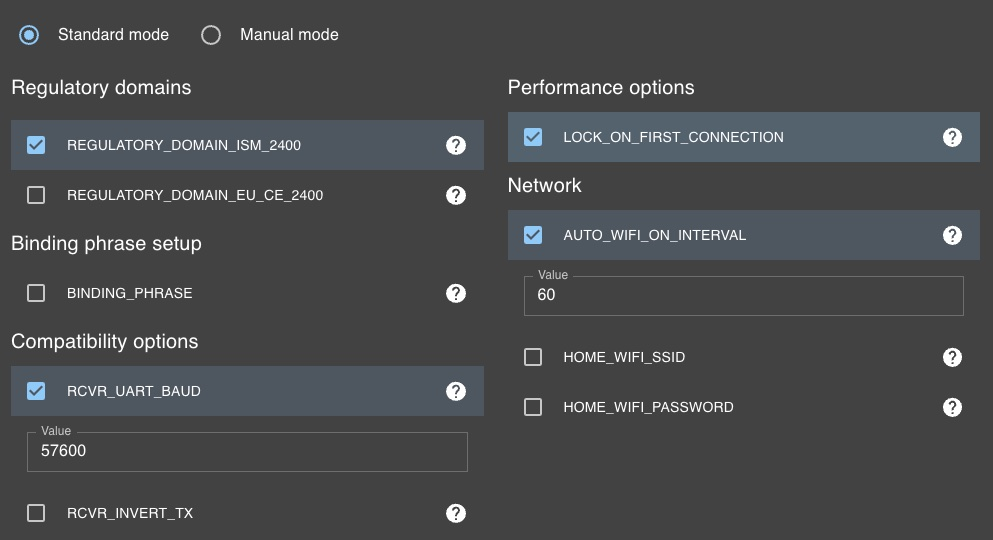

# CRSF Visualizer

## What is this?
This is an Open-Source project that aims to create a general purpose led controller (maybe other stuff as well in the future?) that reacts to channel values of an FPV Remote.
We achieve this by connecting a standard Receiver (needs to use CRSF protocol, e.g. Crossfire or ELRS Receivers) which gets bound in parallel to the "main" drone receiver so that both receivers receive the same signals from the Remote Controller.

## What do you need?
1. An ESP8266 or ESP32 micrcontroller
    - i used this one from aliexpress [https://aliexpress.com](https://de.aliexpress.com/item/1005004341489110.html?spm=a2g0o.order_list.order_list_main.16.13115c5f8k60hf&gatewayAdapt=glo2deu) pay attention! there is also a RP2040 and a ESP32 C3 (not S3) version, i did not test the RP2040 and the C3 definitely didnt work for me as there was a timing issue with the leds which made them flicker all the time
    - you can also easily use an ESP8266, the code supports both (i tested it with a Wemos D1 mini) [https://amazon.de](https://www.amazon.de/PNGOS-ESP8266-ESP-12F-Internet-Development/dp/B0BVFT8DY7/ref=sr_1_3?__mk_de_DE=%C3%85M%C3%85%C5%BD%C3%95%C3%91&crid=ES8R3011K0U&keywords=wemos+d1+mini&qid=1684917622&sprefix=wemos+d1+mini%2Caps%2C112&sr=8-3)
2. Some RGBIC leds (e.g. WS2812 or NEOPIXEL) that can run off 5V and fit inside the transmitter case.
    - [https://aliexpress.com](https://de.aliexpress.com/item/4000744555910.html?spm=a2g0o.order_list.order_list_main.23.13115c5f8k60hf&gatewayAdapt=glo2deu)
3. obviously some wires

> for the Jumper T20s i created some "spacers" that fit between the case and the gimbals and you can wrap the LED Strip (3mm width) i mentioned above around them perfectly (you might have seen this on Facebook ^^)  
this is the link to the stl, best to print it in transparent/translucent SLA, FDM might work as well but it didnt try that yet.
 

[Link to Onshape Design Files](https://cad.onshape.com/documents/9372b4ba1ccb6604f519de5e/w/c26dfce37e630742c9b69cd2/e/3f6f92aa5e4e4860853a745e?renderMode=0&uiState=658f0b8872334c18f213bce2)

## Hardware Connections

### How to power the setup?
The setup needs a constant 5V power source... How to grab power from your transmitter? Depends on your transmitter... So i cannot answer it for all Transmitters.
For my Jumper T20s i found 2 viable solutions:

1. "steal" it from the ELRS module by running the ESP in parallel to the Module
2. get it from one of the two LED Ports on the internal PCB of the radio

> If you dont know how to figure out which Pins are able to power this setup, this whole led project might be too much for you and you should either not do it, or let someone do it for you how knows more about electronics and stuff like this.

### Pins & Configuration
all pins used for this project can be configured in the file `include/const.h`
if your esp does not have the "default" pins, you can easily change them.

the same goes for a lot of configuration variables,
you can for example set your home wifi ssid and password if you want to use your home network for OTA updates instead of the esp creating a Hotspot, you can also re-map the used radio channels if e.g. your throttle is not on channel 3 you can configure it to use a different channel.
just take a look at that file to see what you can configure (there is quite a lot)

### RX
by default this project uses pin `5` as RX and pin `19` as TX pins.
connect your receivers `RX to 19` (tx)
and your receivers `TX to 5` (rx)
you also need to connect your receivers `GND` and `5V/VCC` pad to the corresponding pads on the ESP.

### LEDS
by default this project uses pin `16` and `17` to control the RGBIC leds (`35 leds each` by default).
Connect the `Data IN` pins of your leds to pin `16` (left stick) and `17` (right stick),
you also need to connect the `GND` pin of the leds to `GND` of the ESP.
If you want to power your leds externally you need to connect + and - of the leds to your power supply,
otherwise you need to connect + to 5V and - to GND of the Wemos D1.

by default this project assumes you use `35 leds` per stick.
if you want to control a different amount of leds, change the `LEFT_STICK_NUM_LEDS` and `RIGHT_STICK_NUM_LEDS` variables in the `include/const.h` file accordingly, same goes for chaning pins, color order, etc..

## RX Setup
if you managed to get this working with an RX (type) that is not listed here, feel free to add instructions in a PR/issue :) 

### ELRS

#### Flashing
As we use `SoftwareSerial` to talk to the RX, we need to limit the `Baud Rate to a maximum of 57600`.
Therefore we need to set this baud rate when flashing the elrs rx.
Apart from this, we dont need to set anything special on the rx configuration when flashing it.

Here is a Screenshot of a working configuration.

#### Disable Telemetry
In order to use multiple ELRS rx at the same time, we need to `disable the telemetry` for all but the main rx.
To do this, enable the `WiFi mode` of the rx (e.g. by waiting until it goes into wifi mode when no remote is powered on) and go to the Web-Interface of your rx.

usually you can access it via [http://elrs_rx.local/](http://elrs_rx.local/)

from the web interface, navigate to the `Model` tab and enable `Force telemetry OFF on this receiver`,
then hit `Save`

after this you should see a `success` message.

Your done, you can now connect your Main rx (e.g. Drone) and your crsf-visualizer rx at the same time 🎉

## OTA Updates
nobody wants to open up their goggles front plate or wherever you will put this visualizer only to install an update.
therefore this project uses `OTA` updates, which means you can connect the ESP to your wifi or open a hotspot connection through which you can then flash the latest firmware.
If you want the visualizer to connect to your local WiFi, please specify your home SSID and password in `include/const.h` before flashing.

To enable OTA update mode you need to turn on the visualizer and the remote.
Now you need to turn OFF the arm switch, turn ON the led controll switch and move both sticks to the top outside.
The visualizer should start blinking blue or purple.

- fast blue flashing = trying to connect to your wifi
- slow blue flashign = connected to your wifi
- slow purple flashing = hotspot mode active
    - Default SSID: `Remote Visualizer`
    - Default Password: `blinkyblink`

When connected to the hotspot, the esp's ip is `10.0.0.1`
When connected to your local wifi, the ip cannot be known in advance, therefore you need to check your router to figure out whats the ip of the esp.

If you are not using the hotspot, you need to change the ip of the esp in the `platformio.ini` file.

If you know want to flash the esp, just select the correct environment (all OTA variants end with `_ota`) in platformio and hit flash. (Of course you need to be connected to the same wifi/hotspot as the esp)

## Responsibility and Warranty

    Obviously this mod voids your warranty on the goggles.
    I am NOT responsible for any damage caused by this modification or the code provided.
    Anything you do is your own responsibility.
    If you dont have enough skills to do this yourself, please dont try it in the first place, these goggles are fucking expensive.